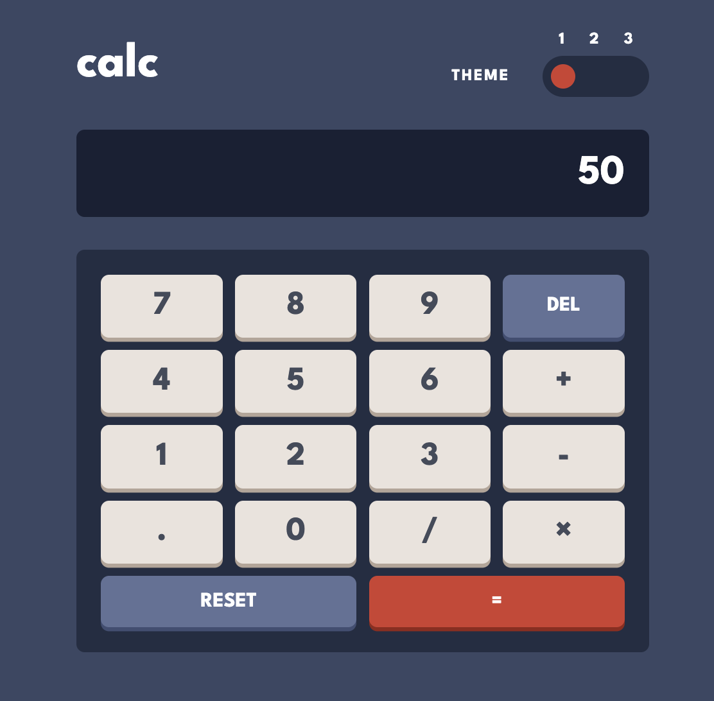
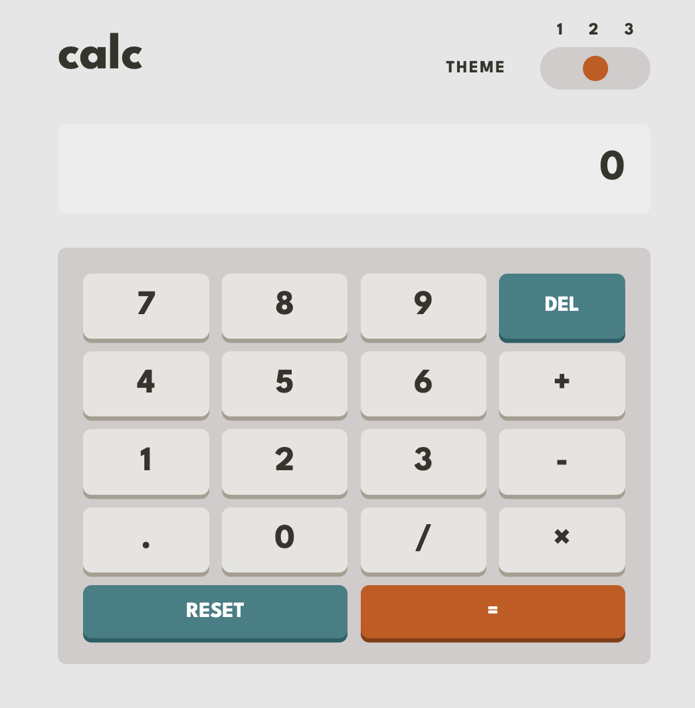
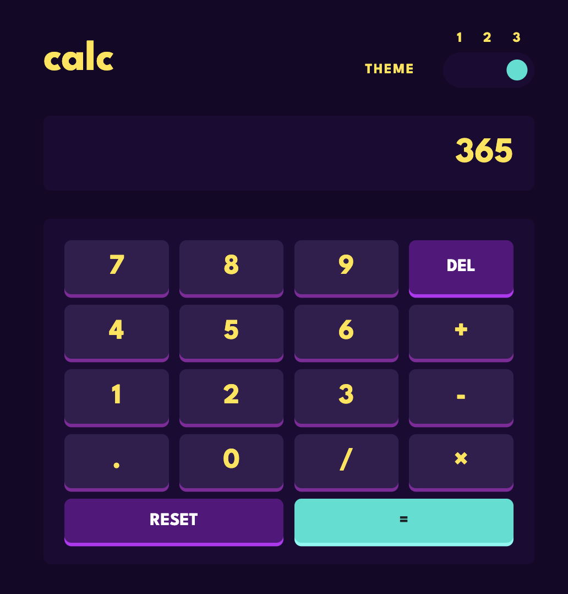

# Frontend Mentor - Calculator app solution

This is a solution to the [Calculator app challenge on Frontend Mentor](https://www.frontendmentor.io/challenges/calculator-app-9lteq5N29). Frontend Mentor challenges help you improve your coding skills by building realistic projects.

## Table of contents

- [Overview](#overview)
  - [The challenge](#the-challenge)
  - [Screenshot](#screenshot)
  - [Links](#links)
- [My process](#my-process)
  - [Built with](#built-with)
  - [What I learned](#what-i-learned)
  - [Continued development](#continued-development)
  - [Useful resources](#useful-resources)
- [Author](#author)

## Overview

### The challenge

Users should be able to:

- See the size of the elements adjust based on their device's screen size
- Perform mathmatical operations like addition, subtraction, multiplication, and division
- Adjust the color theme based on their preference
- **Bonus**: Have their initial theme preference checked using `prefers-color-scheme` and have any additional changes saved in the browser

### Screenshot





### Links

- Solution URL: [Solution](https://www.frontendmentor.io/solutions/calculator-app-vanilla-js-_RyQaG_dXq)
- Live Site URL: [Calculator](https://vicschbt.github.io/PERSO-calculator-app/)

## My process

### Built with

- Semantic HTML5 markup
- CSS custom properties
- SCSS
- Flexbox
- CSS Grid
- Mobile-first workflow
- Vanilla JS

### What I learned

On the UI side, the theme switcher was a challenge, but after looking at my past projects and a bit of reflexion I manage to create this component.

```html
<section class="calculator-header__theme">
	<p class="calculator-header__theme-title">theme</p>
	<div class="calculator-header__theme-labels">
		<label
			for="calculator-header__theme-switch-1"
			class="calculator-header__theme-label"
			>1</label
		>
		<label
			for="calculator-header__theme-switch-2"
			class="calculator-header__theme-label"
			>2</label
		>
		<label
			for="calculator-header__theme-switch-3"
			class="calculator-header__theme-label"
			>3</label
		>
	</div>
	<div class="calculator-header__theme-inputs">
		<span class="calculator-header__theme-cursor"></span>
		<input
			type="radio"
			name="calculator-header__theme-switch"
			id="calculator-header__theme-switch-1"
			class="calculator-header__theme-switch"
			value="1"
		/>
		<input
			type="radio"
			name="calculator-header__theme-switch"
			id="calculator-header__theme-switch-2"
			class="calculator-header__theme-switch"
			value="2"
		/>
		<input
			type="radio"
			name="calculator-header__theme-switch"
			id="calculator-header__theme-switch-3"
			class="calculator-header__theme-switch"
			value="3"
		/>
	</div>
</section>
```

```scss
&__theme {
	display: grid;
	grid-template-columns: repeat(2, 1fr);
	grid-template-areas: '. labels' 'title switch';
	gap: 0.5rem;
	&-title {
		grid-area: title;
		align-self: center;
		justify-self: center;
		color: var(--theme-selector-text-color);
		text-transform: uppercase;
		letter-spacing: 0.1rem;
		font-size: 1rem;
	}
	&-labels {
		grid-area: labels;
		display: flex;
		justify-content: space-between;
		padding: 0 1rem;
	}
	&-inputs {
		grid-area: switch;
		position: relative;
		background-color: var(--theme-selector-bg);
		height: 2.5rem;
		width: 6.5rem;
		border-radius: 1.25rem;
	}

	&-label {
		color: var(--theme-selector-text-color);
	}
	&-switch {
		display: none;
	}
	&-cursor {
		display: block;
		position: absolute;
		height: 1.5rem;
		width: 1.5rem;
		background-color: var(--theme-cursor-color);
		border-radius: 0.75rem;
		top: 0.5rem;
		left: 0.5rem;
		transition: transform 0.25s ease-in;

		&.theme-2 {
			transform: translateX(2rem);
		}
		&.theme-3 {
			transform: translateX(4rem);
		}
	}
}
```

```js
const body = document.querySelector('body');
const themeSwitch = document.querySelector('.calculator-header__theme-inputs');
const themeCursor = document.querySelector('.calculator-header__theme-cursor');
const themeInputs = document.querySelectorAll(
	'.calculator-header__theme-inputs input'
);

let currentTheme = 1;
const minX = themeSwitch.getBoundingClientRect().left;
const maxX = themeSwitch.getBoundingClientRect().right;
const third = (maxX - minX) / 3;

const updateCurrentTheme = (theme) => {
	if (currentTheme != 1) themeCursor.classList.remove(`theme-${currentTheme}`);
	body.classList.remove(`theme-${currentTheme}`);
	currentTheme = theme;
	if (currentTheme != 1) themeCursor.classList.add(`theme-${currentTheme}`);
	body.classList.add(`theme-${currentTheme}`);
};

themeSwitch.addEventListener('click', (event) => {
	const x = event.clientX - minX;
	if (x < third) {
		updateCurrentTheme(1);
	} else if (x < 2 * third) {
		updateCurrentTheme(2);
	} else {
		updateCurrentTheme(3);
	}
	if (currentTheme != 1) themeCursor.classList.add(`theme-${currentTheme}`);
});

themeInputs.forEach((input) =>
	input.addEventListener('change', (event) =>
		updateCurrentTheme(event.target.value)
	)
);
```

### Continued development

Some ideas:

- Make the theme switcher accessible;
- Unit testing;
- A panel to view the history of calculation.

### Useful resources

- [How to build an HTML calculator app from scratch using JavaScript](https://www.freecodecamp.org/news/how-to-build-an-html-calculator-app-from-scratch-using-javascript-4454b8714b98/) - This helped me for understanding all the mecanics behind the calculator app. This article is a step-by-step explanation including a section about refactoring and good practices.

## Author

- Frontend Mentor - [@VicSchbt](https://www.frontendmentor.io/profile/VicSchbt)
- LinkedIn - [Victoire Schubert](www.linkedin.com/in/victoire-schubert)
- Instagram - [@vicschbt.codes](https://www.instagram.com/vicschbt.codes?igsh=OHczMzcwMWpjZm1p&utm_source=qr)
